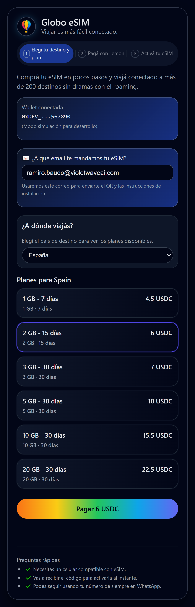
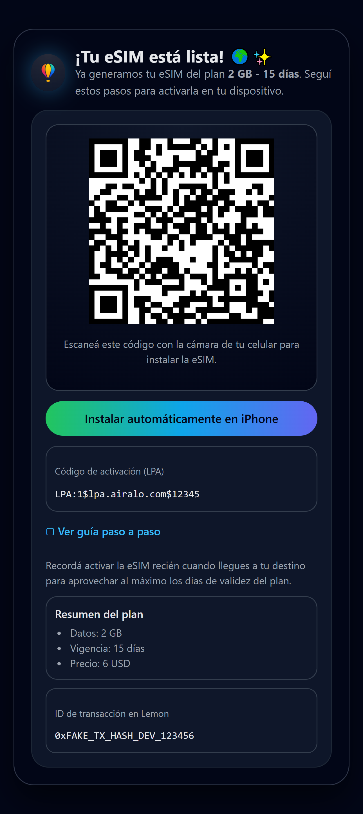
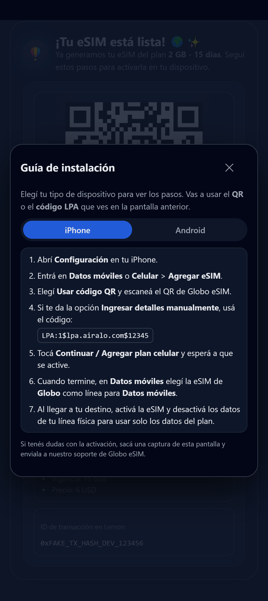
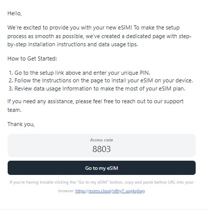

# 🌍 Globo eSIM — Mini-App para Lemon Cash  
**Venta de eSIM para viajeros, pagadas con USDC**

Globo eSIM es una **mini-app integrada al ecosistema de Lemon Cash** que permite a cualquier usuario comprar eSIM internacionales en más de **200 países**, con pago directo en **USDC** y activación instantánea.

La app está construida con **React + TypeScript + Vite**, integrada al SDK oficial de Lemon, y conectada a la **Airalo Partner API** para la provisión real de eSIMs.

---

## 🚀 Características principales

### 🟣 1. Integración completa con Lemon Mini-Apps
- Autenticación de usuario con `authenticate()`
- Detección de WebView con `isWebView()`
- Pago simulado en USDC mediante `deposit()`
- UI optimizada para WebView en iOS/Android

### 🟢 2. Integración Airalo Partner API (Sandbox)
- Obtención de planes por país  
- Creación de órdenes de eSIM  
- Recepción de:
  - QR de instalación  
  - Código LPA (activation code)  
  - Enlace automático de instalación en iPhone  
  - Guía de instalación paso a paso  
- Todo en **modo Sandbox**, sin activar eSIMs reales

### 🔵 3. Flujo completo para el usuario final
1. Seleccionar país de destino  
2. Elegir un plan  
3. Pagar con USDC en Lemon  
4. Recibir la eSIM lista para activar  
5. Instalar mediante:
   - QR  
   - Instalación automática en iPhone  
   - Código LPA manual  
6. Acceso a guía integrada para iPhone y Android

### 💎 4. UI moderna, clara y responsiva
- Paleta personalizada de Globo eSIM  
- Ventanas modales limpias para guías  
- Estilo profesional tipo “mini-app oficial”  
- Totalmente responsive para Lemon WebView

---

## 🏗️ Arquitectura

/frontend → React + TypeScript + Vite (Mini-App Lemon)
/server → Node + Express + Axios (Airalo Partner API client)


### Frontend
- React + TS
- Vite  
- CSS-in-JS
- Lemon Mini-App SDK (`authenticate`, `deposit`, `isWebView`)

### Backend
- Express.js  
- Axios  
- Módulo de token caching para Airalo  
- Endpoints:
  - `GET /api/airalo/packages`
  - `POST /api/airalo/orders`

---

## 🔐 Integraciones externas

### 🟢 Lemon Cash Mini-Apps  
- Documentación: https://lemoncash.mintlify.app  
- Se utiliza para:
  - Autenticación del usuario
  - Verificación del entorno (WebView)
  - Pago en USDC

### 🟣 Airalo Partner API  
- Documentación: https://partners-api.airalo.com  
- Se utiliza para:
  - Obtener token
  - Listar planes
  - Crear órdenes de eSIM

---


## 📱 Screenshots de la Mini-App Globo eSIM

A continuación se muestran vistas reales de la mini-app funcionando en modo sandbox con Airalo.

---


### 🌍 Selección de país y compra del e-sim


### 🎉 eSIM generada (QR + LPA)


### 📖 Instrucciones (QR + LPA)


### 📖 Instrucciones por email 

---

## 🛠️ Scripts de desarrollo

### Frontend
```bash
npm install
npm run dev
npm run build


### Frontend
npm install
npm run dev
npm start


📦 Variables de entorno
Frontend
VITE_LEMON_ENV=dev
VITE_API_BASE=http://localhost:4000

Backend
AIRALO_CLIENT_ID=
AIRALO_CLIENT_SECRET=
AIRALO_API_BASE=https://partners-api.airalo.com
AIRALO_BRAND_NAME=
AIRALO_DEFAULT_COPY_EMAIL=
PORT=4000
